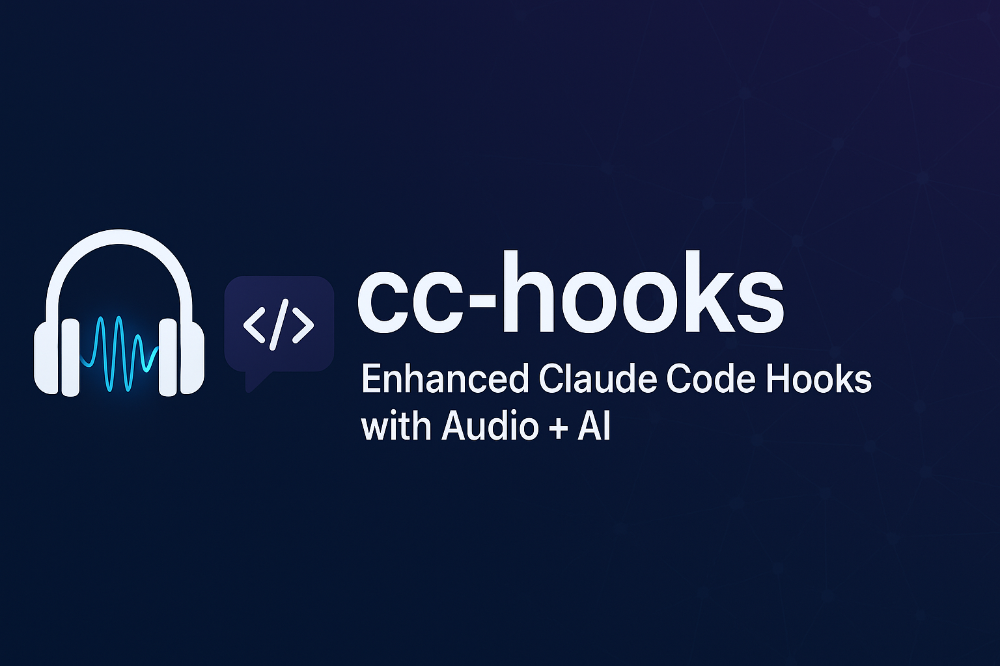
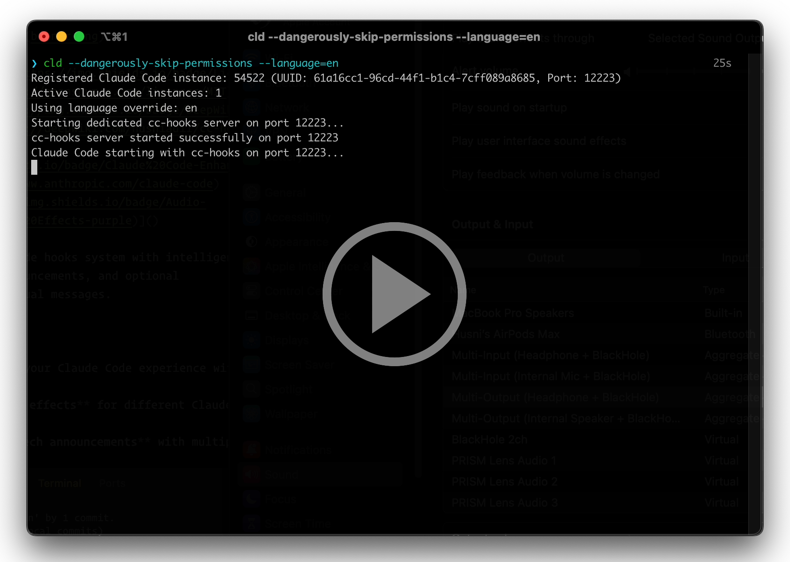

# cc-hooks



[](https://opensource.org/licenses/MIT)
[](https://deepwiki.com/husniadil/cc-hooks)
[](https://www.anthropic.com/claude-code)
[]()

Enhanced Claude Code hooks system with intelligent audio feedback, TTS announcements, and optional
AI-powered contextual messages.

## Overview

cc-hooks enhances your Claude Code experience with:

- 🔊 **Smart sound effects** for different Claude Code events
- 🗣️ **Text-to-speech announcements** with multiple provider options
- 🤖 **AI-powered contextual messages** that understand your conversation
- 🌍 **Multilingual support** for international users
- ⚡ **Multi-instance support** - run multiple Claude Code sessions simultaneously

## Demo

[](https://www.youtube.com/watch?v=VXkKhgeZ-xU)

_Watch cc-hooks in action with premium ElevenLabs text-to-speech integration_

## Quick Start (Recommended)

Get up and running in 2 minutes with full audio feedback:

### Prerequisites

- Python 3.12+
- [uv](https://docs.astral.sh/uv/) package manager (install via
  `curl -LsSf https://astral.sh/uv/install.sh | sh`)
  - After installation, restart your shell or run `source ~/.bashrc` (or `~/.zshrc`)
  - Verify with: `uv --version` (should work from any directory)
- Node.js ≥20.19.4 (for ccusage dependency)
- [Claude Code](https://claude.ai/code) CLI tool

> **Optional**: Use [mise](https://mise.jdx.dev/) to automatically install Python, uv, and Node.js
> from `.tool-versions`

### Installation

1. **Clone and install dependencies:**

   ```bash
   git clone https://github.com/husniadil/cc-hooks.git
   cd cc-hooks

   # Optional: Use mise to install Python, uv, and Node.js automatically
   # mise install

   npm install
   ```

2. **Verify setup:**

   ```bash
   npm run check
   ```

3. **Add hooks to Claude Code settings:**

   Edit your Claude Code settings (typically `~/.claude/settings.json`):

   ```json
   {
     "$schema": "https://json.schemastore.org/claude-code-settings.json",
     "model": "sonnet",
     "hooks": {
       "SessionStart": [
         {
           "matcher": "",
           "hooks": [
             {
               "type": "command",
               "command": "uv run /path/to/cc-hooks/hooks.py"
             }
           ]
         }
       ],
       "SessionEnd": [
         {
           "matcher": "",
           "hooks": [
             {
               "type": "command",
               "command": "uv run /path/to/cc-hooks/hooks.py"
             }
           ]
         }
       ],
       "PreToolUse": [
         {
           "matcher": "",
           "hooks": [
             {
               "type": "command",
               "command": "uv run /path/to/cc-hooks/hooks.py --sound-effect=sound_effect_tek.mp3"
             }
           ]
         }
       ],
       "PostToolUse": [
         {
           "matcher": "",
           "hooks": [
             {
               "type": "command",
               "command": "uv run /path/to/cc-hooks/hooks.py --sound-effect=sound_effect_cetek.mp3"
             }
           ]
         }
       ],
       "Notification": [
         {
           "matcher": "",
           "hooks": [
             {
               "type": "command",
               "command": "uv run /path/to/cc-hooks/hooks.py --sound-effect=sound_effect_tung.mp3"
             }
           ]
         }
       ],
       "UserPromptSubmit": [
         {
           "matcher": "",
           "hooks": [
             {
               "type": "command",
               "command": "uv run /path/to/cc-hooks/hooks.py --sound-effect=sound_effect_klek.mp3"
             }
           ]
         }
       ],
       "Stop": [
         {
           "matcher": "",
           "hooks": [
             {
               "type": "command",
               "command": "uv run /path/to/cc-hooks/hooks.py"
             }
           ]
         }
       ],
       "SubagentStop": [
         {
           "matcher": "",
           "hooks": [
             {
               "type": "command",
               "command": "uv run /path/to/cc-hooks/hooks.py --sound-effect=sound_effect_cetek.mp3"
             }
           ]
         }
       ],
       "PreCompact": [
         {
           "matcher": "",
           "hooks": [
             {
               "type": "command",
               "command": "uv run /path/to/cc-hooks/hooks.py"
             }
           ]
         }
       ]
     },
     "statusLine": {
       "type": "command",
       "command": "uv run /path/to/cc-hooks/status-lines/status_line.py"
     }
   }
   ```

   **Replace `/path/to/cc-hooks` with your actual installation path** (find it with `pwd` in the
   cc-hooks directory).

4. **Create basic configuration:**

   ```bash
   cp .env.example .env
   ```

   The default settings work perfectly for Quick Start - no editing needed!

5. **Create command alias (recommended):**

   Add this to your shell config (`.bashrc`, `.zshrc`, etc.):

   ```bash
   cld() {
       local original_dir="$PWD"
       (cd /path/to/cc-hooks && CC_ORIGINAL_DIR="$original_dir" ./claude.sh "$@")
   }
   ```

   **Replace `/path/to/cc-hooks` with your actual installation path.**

   This alias allows you to run `cld` from **any directory** on your system - Claude Code will start
   with all the audio enhancements while working in your current project folder.

6. **Start using:**

   ```bash
   # Use your alias from any directory (recommended)
   cd ~/my-project
   cld

   # Or navigate to cc-hooks directory first
   cd /path/to/cc-hooks && ./claude.sh
   ```

You're all set! Claude Code will now have complete audio feedback with sound effects for all events.
No configuration files needed!

---

## Intermediate Setup (Dynamic Voice Generation)

Want real-time generated voice announcements? Add Google TTS or premium ElevenLabs:

### Option A: Google TTS (Free)

1. **Edit your existing `.env` file:**

   ```bash
   # Enable Google TTS
   TTS_PROVIDERS=gtts,prerecorded
   TTS_LANGUAGE=en
   TTS_CACHE_ENABLED=true
   ```

2. **Add `--announce` to specific hooks** (if you want voice announcements):

   Update your existing hooks from Quick Start by adding `--announce` to these events:
   - `SessionStart`, `SessionEnd`, `Stop`, `PreCompact` → Add `--announce`
   - `Notification` → Already has sound effect, add `--announce`
   - Keep `PreToolUse`, `PostToolUse`, `UserPromptSubmit` as sound-only

### Option B: ElevenLabs (Premium Quality)

1. **Get your API key** from
   [elevenlabs.io/app/developers/api-keys](https://elevenlabs.io/app/developers/api-keys)

2. **Edit your existing `.env` file:**

   ```bash
   # Premium ElevenLabs TTS
   TTS_PROVIDERS=elevenlabs,gtts,prerecorded
   ELEVENLABS_API_KEY=your_api_key_here
   ELEVENLABS_VOICE_ID=21m00Tcm4TlvDq8ikWAM  # Rachel voice (default)
   ```

   **⚠️ Important**: The `ELEVENLABS_VOICE_ID` must be from either:
   - **My Voices**: https://elevenlabs.io/app/voice-lab (your custom voices)
   - **Default Voices**: https://elevenlabs.io/app/default-voices (built-in voices)

   Using voice IDs from other sources will fail and automatically fallback to the next TTS provider.

3. **Follow the same hook update steps as Google TTS above**

---

## Advanced Setup (AI-Powered Contextual Messages)

Get intelligent, context-aware announcements that understand your conversation:

### Requirements

- OpenRouter API account ([get free credits](https://openrouter.ai/keys))
- Text-to-speech already configured (see Intermediate Setup)

### Configuration

1. **Add OpenRouter to your `.env`:**

   ```bash
   # AI Features
   OPENROUTER_ENABLED=true
   OPENROUTER_API_KEY=your_openrouter_key
   OPENROUTER_MODEL=openai/gpt-4o-mini

   # Enable contextual messages (costs apply!)
   OPENROUTER_CONTEXTUAL_STOP=true              # Smart completion messages
   OPENROUTER_CONTEXTUAL_PRETOOLUSE=true        # Intelligent tool announcements

   # TTS (required for contextual features)
   TTS_PROVIDERS=elevenlabs,gtts,prerecorded    # Your choice
   ```

2. **Enable contextual AI for key events:**

   For AI contextual features, add `--announce` to these important hooks:
   - **PreToolUse** → `--sound-effect=sound_effect_tek.mp3 --announce`
   - **Stop** → `--announce`

   These are the most valuable events for AI contextual messages. Other hooks can remain as-is from
   Quick Start.

### What You Get

- **Smart completion messages**: "I've successfully implemented the user authentication system as
  requested"
- **Contextual tool announcements**: "Running tests to validate the login functionality you just
  built"
- **Multilingual support**: Automatically translates to your preferred language
- **Cost-optimized**: Only generates AI messages when needed

> **⚠️ Important**: Contextual AI features only work when `--announce` is included in your hook
> commands. Without it, contextual messages won't be generated.

---

## Configuration Reference

All configuration is done through the `.env` file. Key settings:

### TTS Providers

- `TTS_PROVIDERS=prerecorded` - Default (sound effects only)
- `TTS_PROVIDERS=gtts,prerecorded` - Add Google TTS
- `TTS_PROVIDERS=elevenlabs,gtts,prerecorded` - Premium ElevenLabs + fallbacks

### Languages

- `TTS_LANGUAGE=en` - English (default)
- `TTS_LANGUAGE=id` - Indonesian
- `TTS_LANGUAGE=es` - Spanish, etc.

### API Keys

- `ELEVENLABS_API_KEY=` - For premium TTS ([get key](https://elevenlabs.io/app/developers/api-keys))
- `OPENROUTER_API_KEY=` - For AI features ([get key](https://openrouter.ai/keys))

### Per-Session Configuration Overrides

Override language, voice, and provider settings for individual Claude Code sessions without
modifying your `.env` file:

```bash
# Use Indonesian TTS for this session
cld --language=id

# Use specific ElevenLabs voice for this session
cld --elevenlabs-voice-id=21m00Tcm4TlvDq8ikWAM

# Override TTS providers for this session
cld --tts-providers=gtts,prerecorded

# Silent mode options (granular control over audio)
cld --silent                      # Disable both announcements and sound effects
cld --silent=all                  # Same as above (explicit)
cld --silent=announcements        # Disable TTS only, keep sound effects
cld --silent=sound-effects        # Disable sound effects only, keep TTS

# Combine all overrides for comprehensive session customization
cld --language=es --elevenlabs-voice-id=21m00Tcm4TlvDq8ikWAM --tts-providers=elevenlabs,gtts

# Multiple concurrent sessions with different configurations
cld --language=id --tts-providers=gtts,prerecorded    # Session 1: Indonesian + Google TTS
cld --language=es --tts-providers=elevenlabs          # Session 2: Spanish + ElevenLabs only
cld --silent=announcements                            # Session 3: Sound effects only (no TTS)
cld --silent=sound-effects                            # Session 4: TTS only (no sound effects)
cld --silent                                          # Session 5: Complete silence
```

**Configuration Precedence** (highest to lowest priority):

1. Session parameters (`--language`, `--elevenlabs-voice-id`, `--tts-providers`, `--silent`)
2. Environment variables (`TTS_LANGUAGE`, `ELEVENLABS_VOICE_ID`, `TTS_PROVIDERS`)
3. Default values

This allows you to:

- Run multiple Claude Code sessions with different languages simultaneously
- Test different voices without changing your global configuration
- Switch languages per project without config file modifications
- Granular audio control: disable TTS only, sound effects only, or both
- Perfect for meetings (silent mode) or focused work (announcements only)

## Troubleshooting

### Validation

Run the setup checker to verify your installation:

```bash
npm run check
```

For detailed validation output:

```bash
npm run check:verbose
```

### Common Issues

**Sound effects not playing?**

- Check that your audio system is working
- Verify that sound files exist in the `sound/` directory

**TTS not working?**

- Ensure you have `--announce` in your hook commands
- Check your `.env` file has correct TTS provider settings
- For Google TTS: requires internet connection
- For ElevenLabs: verify your API key is valid

**AI contextual messages not working?**

- Verify `OPENROUTER_ENABLED=true` and API key is set
- **Critical**: Contextual features require `--announce` in hook commands
- Check that contextual flags are enabled: `OPENROUTER_CONTEXTUAL_STOP=true`

## Credits

Sound effects generated using [ElevenLabs](https://elevenlabs.io) voice synthesis technology.

## License

MIT - see [LICENSE](LICENSE) for details.
