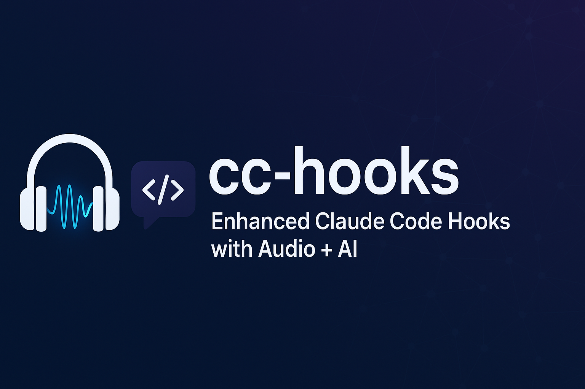

# cc-hooks - Standalone Installation



**Give Claude Code a voice with standalone installation!**

This guide is for **developers, contributors, and advanced users** who want full control over the
installation path and development workflow.

## When to Use Standalone Mode

Choose standalone installation if you:

- **Contribute to cc-hooks** - Need full source access for development
- **Test changes** - Want to test modifications before creating PRs
- **Custom paths** - Prefer installing in specific directories
- **Development workflow** - Need direct access to source code

**For most users**: Use [Plugin Installation](README.md) instead - it's simpler and updates
automatically.

## Prerequisites

- **Python 3.12+** (recommended: 3.12.7)
- **[uv](https://docs.astral.sh/uv/)** package manager
- **Claude Code** CLI installed
- **Git** (for cloning and updates)

## Installation

### Step 1: Clone the Repository

Choose your installation directory (anywhere you want):

```bash
# Example: Install in your projects folder
cd ~/projects
git clone https://github.com/husniadil/cc-hooks.git
cd cc-hooks

# Or install in a different location
cd /path/to/your/preferred/location
git clone https://github.com/husniadil/cc-hooks.git
cd cc-hooks
```

### Step 2: Install Dependencies

Dependencies are managed via PEP 723 inline metadata in `server.py` and `hooks.py`. They'll be
automatically installed when you run the scripts with `uv`.

Test installation:

```bash
# This will install dependencies automatically
uv run --script server.py --help
```

### Step 3: Configure Hooks Manually

**IMPORTANT**: Unlike plugin mode, you need to manually configure hooks in
`~/.claude/settings.json`.

Edit your settings file:

```bash
nano ~/.claude/settings.json
```

Add the hooks configuration (replace `/path/to/cc-hooks` with your actual installation path):

```jsonc
{
  "$schema": "https://json.schemastore.org/claude-code-settings.json",
  // ... your other settings ...
  "hooks": {
    "SessionStart": [
      {
        "matcher": "",
        "hooks": [
          {
            "type": "command",
            "command": "uv run /path/to/cc-hooks/hooks.py"
          }
        ]
      }
    ],
    "SessionEnd": [
      {
        "matcher": "",
        "hooks": [
          {
            "type": "command",
            "command": "uv run /path/to/cc-hooks/hooks.py"
          }
        ]
      }
    ],
    "PreToolUse": [
      {
        "matcher": "",
        "hooks": [
          {
            "type": "command",
            "command": "uv run /path/to/cc-hooks/hooks.py"
          }
        ]
      }
    ],
    "PostToolUse": [
      {
        "matcher": "",
        "hooks": [
          {
            "type": "command",
            "command": "uv run /path/to/cc-hooks/hooks.py"
          }
        ]
      }
    ],
    "UserPromptSubmit": [
      {
        "matcher": "",
        "hooks": [
          {
            "type": "command",
            "command": "uv run /path/to/cc-hooks/hooks.py"
          }
        ]
      }
    ],
    "Stop": [
      {
        "matcher": "",
        "hooks": [
          {
            "type": "command",
            "command": "uv run /path/to/cc-hooks/hooks.py"
          }
        ]
      }
    ],
    "Notification": [
      {
        "matcher": "",
        "hooks": [
          {
            "type": "command",
            "command": "uv run /path/to/cc-hooks/hooks.py"
          }
        ]
      }
    ],
    "SubagentStop": [
      {
        "matcher": "",
        "hooks": [
          {
            "type": "command",
            "command": "uv run /path/to/cc-hooks/hooks.py"
          }
        ]
      }
    ],
    "PreCompact": [
      {
        "matcher": "",
        "hooks": [
          {
            "type": "command",
            "command": "uv run /path/to/cc-hooks/hooks.py"
          }
        ]
      }
    ]
  }
}
```

### Step 4: Set Up Shell Alias (Recommended)

Add to your `.bashrc` or `.zshrc`:

```bash
# cc-hooks standalone mode wrapper
alias cld='/path/to/cc-hooks/claude.sh'
```

Replace `/path/to/cc-hooks` with your actual installation path.

Reload your shell:

```bash
source ~/.bashrc  # or source ~/.zshrc
```

### Step 5: API Keys (Optional - For Premium Features)

For ElevenLabs or AI features, add to your shell config (`~/.bashrc` or `~/.zshrc`):

```bash
# cc-hooks API Keys
export ELEVENLABS_API_KEY="your_key_here"
export OPENROUTER_API_KEY="your_key_here"
```

Then reload: `source ~/.bashrc` or `source ~/.zshrc`

**Get your keys:**

- **ElevenLabs**:
  [elevenlabs.io/app/developers/api-keys](https://elevenlabs.io/app/developers/api-keys)
- **OpenRouter**: [openrouter.ai/keys](https://openrouter.ai/keys) (free credits available)

### Step 6: Test Installation

```bash
# Start Claude Code with cc-hooks
cld

# Or run directly
/path/to/cc-hooks/claude.sh
```

You should hear audio feedback when Claude starts! 🎉

## Usage

Same as plugin mode, just use your installation path:

```bash
# Default: prerecorded sounds
cld

# Google TTS in Indonesian
cld --audio=gtts --language=id

# Premium ElevenLabs voice
cld --audio=elevenlabs

# With AI-powered contextual messages
cld --audio=gtts --ai=full --language=id

# Silent mode
cld --silent
```

See [README.md](README.md) for complete usage documentation (all flags work the same).

## Configuration

Configuration works identically to plugin mode. See [README.md](README.md#configuration) for:

- CLI flags reference
- API keys setup
- Configuration file (`~/.claude/.cc-hooks/config.yaml`)
- Silent modes
- Advanced flags

## Updating

### Check for Updates

```bash
# From cc-hooks directory
npm run version:check

# Or check via API (when server is running)
curl http://localhost:12222/version/status
```

### Update to Latest Version

```bash
# From cc-hooks directory
npm run update

# Or manually
git pull origin main
```

**Important**: Restart Claude Code session after updating.

### Update Process

The update script (`update.sh`):

1. Stashes uncommitted changes (if any)
2. Fetches latest from origin
3. Pulls changes from main branch
4. Verifies `uv` installation
5. Restores stashed changes

## Development Workflow

### Running the System

```bash
# From cc-hooks directory
./claude.sh                    # Start server + Claude Code
npm run dev                    # Development server with hot reload
uv run server.py --dev         # Alternative dev server
uv run server.py               # Server only (testing)
npm run format                 # Format code
```

### Testing

```bash
# Start test server
uv run server.py &
SERVER_PID=$!

# Test hook manually
echo '{"session_id": "test", "hook_event_name": "SessionStart"}' | \
  CC_INSTANCE_ID="test-123" CC_HOOKS_PORT=12222 uv run hooks.py --announce=0.5

# Clean up
kill $SERVER_PID
```

See [CLAUDE.md](CLAUDE.md) for comprehensive development guide.

## Troubleshooting

### Quick Diagnostics

Check your configuration:

```bash
# Verify hooks in settings.json
cat ~/.claude/settings.json | grep hooks.py

# Check server logs
tail -f ~/.claude/.cc-hooks/logs/*.log

# Test sound playback
uv run /path/to/cc-hooks/utils/sound_player.py

# Test TTS system
uv run /path/to/cc-hooks/utils/tts_announcer.py SessionStart
```

### cc-hooks not starting with `--dangerously-skip-permissions` in new folders?

**Symptom:** When running Claude Code with `--dangerously-skip-permissions` flag in a new/untrusted
folder, cc-hooks server doesn't start and hooks don't execute.

**Cause:** Claude Code shows a trust prompt for new folders that requires explicit user approval:

```
 Do you trust the files in this folder?
 /path/to/your/folder
 ❯ 1. Yes, proceed
   2. No, exit
```

When using `--dangerously-skip-permissions`, this prompt doesn't appear but hooks also fail to
execute. This appears to be a limitation in how Claude Code handles the trust flow with this flag.

**Solution:** Run Claude Code **without** the flag first to accept the trust prompt:

```bash
# First run: accept trust prompt (without skip-permissions flag)
cld  # or: /path/to/cc-hooks/claude.sh

# Select "Yes, proceed" when prompted

# Exit Claude Code

# Subsequent runs: flag works normally
cld --dangerously-skip-permissions  # Now hooks will work
```

**Why this works:** Once the folder is trusted, the approval is cached. Future sessions (even with
`--dangerously-skip-permissions`) will execute hooks normally.

**Note:** It's unclear whether this is a Claude Code bug or expected behavior. The flag is meant to
skip permission prompts, but doesn't seem to handle the initial folder trust flow.

### No audio at all?

1. Check system audio is working
2. Verify hooks configured in `~/.claude/settings.json`
3. Check logs: `tail -f ~/.claude/.cc-hooks/logs/*.log`
4. Test manually: `uv run /path/to/cc-hooks/utils/sound_player.py`
5. Test TTS: `uv run /path/to/cc-hooks/utils/tts_announcer.py SessionStart`

### Google TTS not working?

1. Check internet connection
2. Test: `uv run /path/to/cc-hooks/utils/tts_announcer.py --provider gtts SessionStart`

### ElevenLabs not working?

1. Verify API key: `printenv ELEVENLABS_API_KEY`
2. Check quota at [elevenlabs.io](https://elevenlabs.io)
3. Test: `uv run /path/to/cc-hooks/utils/tts_announcer.py --provider elevenlabs SessionStart`

### AI contextual messages not working?

1. Verify API key: `printenv OPENROUTER_API_KEY`
2. Use `--ai=basic` or `--ai=full` flag when starting
3. Check OpenRouter API quota at [openrouter.ai](https://openrouter.ai)

### Hooks not executing?

Check hooks configuration:

```bash
# Verify hooks.py path in settings.json
cat ~/.claude/settings.json | jq '.hooks'

# Check for typos in path
ls -la /path/to/your/cc-hooks/hooks.py

# Test hook directly
echo '{"session_id": "test", "hook_event_name": "SessionStart"}' | \
  CC_INSTANCE_ID="test-123" CC_HOOKS_PORT=12222 uv run /path/to/cc-hooks/hooks.py
```

## Data Storage

Same data directory as plugin mode (shared for seamless migration):

```
~/.claude/.cc-hooks/
├── events.db          # Event queue database
├── logs/              # Per-session logs
│   └── {pid}.log
└── .tts_cache/        # Cached TTS audio (if enabled)
```

## Migrating to Plugin Mode

Want easier updates? See [MIGRATION.md](MIGRATION.md) for step-by-step migration guide to plugin
mode.

**Benefits of migrating:**

- ✅ Automatic hook configuration (no manual settings.json)
- ✅ One-command updates (`/plugin update`)
- ✅ Built-in slash commands (`/cc-hooks-plugin:setup`, `/cc-hooks-plugin:update`)
- ✅ Easier to maintain

Your data in `~/.claude/.cc-hooks/` is automatically preserved during migration!

## Support

- **Issues**: [GitHub Issues](https://github.com/husniadil/cc-hooks/issues)
- **Documentation**: [Main README](README.md) (plugin mode) | This file (standalone mode) |
  [Migration](MIGRATION.md)
- **Development**: [CLAUDE.md](CLAUDE.md) for technical details

## Contributing

1. Fork the repository
2. Create feature branch: `git checkout -b feature/amazing-feature`
3. Make your changes
4. Test thoroughly: `npm run format && npm run dev`
5. Commit: `git commit -m "Add amazing feature"`
6. Push: `git push origin feature/amazing-feature`
7. Open Pull Request

See [CLAUDE.md](CLAUDE.md) for development guidelines.

## License

MIT - see [LICENSE](LICENSE) for details.

---

**Made with ❤️ for the Claude Code community**

For easier installation and automatic updates, consider [Plugin Mode](README.md)! 🎉
